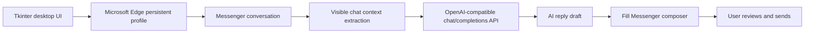

# Messenger Edge Tool

<p align="center">
  
</p>

<p align="center">
  <a href="https://github.com/lhlizdabezt/messenger-edge-tool/releases/latest"></a>
  
  
  
  
</p>

<p align="center">
  <b>Messenger Edge Tool</b> is a local Windows desktop companion for reading visible Messenger context, generating AI-assisted reply drafts, and filling the Messenger composer through Microsoft Edge only when the user is in control.
</p>

<p align="center">
  <sub>Python · Tkinter · Playwright · Microsoft Edge persistent profile · OpenAI-compatible API · Messenger context extraction</sub>
</p>

---

## Why This Repo Exists

Most chat automation demos either skip context quality or send messages too aggressively. This project takes the safer engineering route:

- **Local-first desktop app**: runs from this folder with a repo-local virtual environment.
- **Microsoft Edge runtime**: uses Playwright `channel="msedge"` and a dedicated `edge_profile`.
- **Context-aware drafting**: extracts visible `Them:` / `Me:` conversation lines before calling the AI model.
- **Manual send by default**: drafts are filled into Messenger, then the user reviews before sending.
- **Continuous auto mode**: can watch for new incoming lines, dedupe replies, and keep running until stopped.

---

## Product Flow



---

## Feature Matrix

| Area | Capability | Engineering detail |
| --- | --- | --- |
| Browser automation | Opens Messenger in Edge | Playwright persistent context with `MESSENGER_BROWSER_CHANNEL=msedge` |
| Drafting | Fills the chat composer | Uses the active `contenteditable` Messenger editor |
| AI assistant | Generates reply drafts | OpenAI-compatible `/chat/completions` endpoint |
| Context reading | Pulls visible conversation lines | Anchors extraction around the compose editor to avoid sidebar pollution |
| Auto mode | Watches for new incoming messages | Replies once per latest `Them:` line and keeps auto active |
| Privacy | Stores browser session locally | `edge_profile`, `.env`, contacts and caches are gitignored |
| Safety | No blind bulk sending | Manual send is the default; demo auto-send is explicit opt-in |

---

## Quick Start

Open PowerShell inside the repo folder:

```powershell
powershell -ExecutionPolicy Bypass -File .\setup.ps1
```

Run the app:

```powershell
.\run.bat
```

On first launch, Microsoft Edge opens with a dedicated local profile. Log in to Messenger in that Edge window once; the session is stored in `edge_profile` beside the tool.

---

## AI Configuration

The app supports OpenAI-compatible providers. For Woku Shop, use:

| Field | Value |
| --- | --- |
| API key | `sk-...` |
| Base URL | `https://llm.wokushop.com/v1` |
| Model | `gpt-4o-mini` |

Optional Windows environment variables:

```powershell
setx OPENAI_API_KEY "sk-..."
setx OPENAI_BASE_URL "https://llm.wokushop.com/v1"
setx OPENAI_MODEL "gpt-4o-mini"
```

Restart `run.bat` after changing environment variables.

For official OpenAI, set `OPENAI_BASE_URL` to `https://api.openai.com/v1` and provide a valid OpenAI API key.

---

## Usage

1. Open the `Soan tin` tab.
2. Enter a Messenger link, username, or thread ID.
3. Use `Dien tin nhan` to fill the composer without sending.
4. Use `Gui co xac nhan` only when you want the tool to confirm before sending.
5. Open `AI viet nhap` to generate drafts from context and intent.
6. Use `Doc chat` to pull visible Messenger context into the AI tab.
7. Use `Doc chat + dien tra loi` to read context, draft a reply, and fill it into Messenger.
8. Use `Bat auto khi co tin moi` when you want the tool to keep watching for new incoming messages.

`Demo auto gui` is intentionally separate. Leave it off for normal use.

---

## Repository Layout

```text
messenger-edge-tool/
├─ messenger_tool.py      # Tkinter UI, Playwright session, AI client, context extraction
├─ requirements.txt       # Runtime dependency pin
├─ setup.ps1              # Windows setup and local virtual environment repair
├─ run.bat                # One-click app launcher
└─ README.md              # Public documentation
```

Runtime files such as `.venv`, `edge_profile`, `.env` and `contacts.json` stay local and are ignored by git.

---

## Reviewer Notes

- **Primary stack**: Python, Tkinter, Playwright, Microsoft Edge, OpenAI-compatible APIs.
- **Core engineering problem**: safely connect a browser DOM workflow with AI drafting while preserving user review.
- **Notable reliability work**: Edge runtime migration, broken `.venv` repair path, Messenger same-thread normalization, compose-editor anchored context extraction, and continuous auto-reply dedupe.
- **Security posture**: no credentials in source control, no password storage in code, no default blind sending.

---

## Release

The first public release is intended to document the stable Edge-based workflow:

- Microsoft Edge Playwright runtime.
- Local setup and launcher scripts.
- Messenger context reading and AI drafting.
- Continuous auto mode with one reply per new incoming message.
- Human-in-the-loop send behavior by default.

See the latest release at [GitHub Releases](https://github.com/lhlizdabezt/messenger-edge-tool/releases/latest).

---

## Safety

This tool is for personal drafting assistance and workflow experimentation. Do not use it for spam, harassment, credential collection, platform abuse, or sending messages to people who do not want to receive them.

The AI output should be reviewed by the user before sending. The tool helps write drafts; it does not replace judgment.
