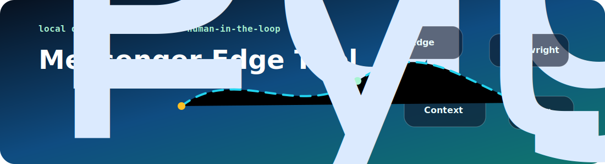
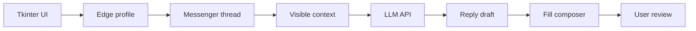

# 💬 Messenger Edge Tool · Trợ lý soạn nháp AI trên Microsoft Edge

<p align="center">
  
</p>

<p align="center">
  <a href="https://github.com/lhlizdabezt/messenger-edge-tool/releases/latest"></a>
  <a href="https://github.com/lhlizdabezt/messenger-edge-tool/tags"></a>
  
  
  
</p>

<p align="center">
  <b>Messenger Edge Tool</b> là công cụ desktop Windows viết bằng Python/Tkinter, dùng Playwright để điều khiển Microsoft Edge, đọc ngữ cảnh Messenger đang hiển thị, tạo nháp trả lời bằng AI và điền vào ô soạn tin khi người dùng chủ động kiểm soát.
</p>

---

## 🚦 Tư duy thiết kế

| Nguyên tắc | Cách repo thể hiện | Lý do quan trọng |
| --- | --- | --- |
| Người dùng kiểm soát | Mặc định là soạn nháp và điền vào ô chat; người dùng tự xem lại trước khi gửi | Tránh gửi nhầm, tránh spam, phù hợp workflow cá nhân |
| Chạy cục bộ | `.venv`, `edge_profile`, `.env`, cache và phiên đăng nhập nằm ngoài Git | Không đưa phiên trình duyệt hoặc khóa API lên repo |
| Dùng Microsoft Edge | `MESSENGER_BROWSER_CHANNEL=msedge`, profile Edge riêng | Đúng môi trường người dùng đang dùng, không ép Chrome |
| Đọc ngữ cảnh có chọn lọc | Trích hội thoại quanh khung soạn, giảm nhiễu sidebar | Cải thiện chất lượng nháp AI |
| Auto có chặn trùng | Ghi nhớ tin nhắn mới nhất đã xử lý | Tránh lặp trả lời cùng một dòng |

## 🧭 Luồng hoạt động



## ✨ Tính năng chính

| Nhóm | Tính năng | Chi tiết triển khai |
| --- | --- | --- |
| Trình duyệt | Mở Messenger bằng Edge | Playwright persistent context với thư mục `edge_profile` |
| Soạn tin | Điền nội dung vào composer | Nhắm vào vùng `contenteditable` đang hoạt động |
| AI | Sinh nháp từ mục tiêu và ngữ cảnh | Endpoint `/chat/completions` tương thích OpenAI |
| Đọc chat | Lấy các dòng `Them:` và `Me:` đang nhìn thấy | Ưu tiên vùng hội thoại thật, hạn chế đọc nhầm sidebar |
| Auto | Theo dõi tin nhắn đến | Chỉ phản hồi một lần cho tin mới, giữ auto chạy đến khi tắt |
| Bảo mật | Không hard-code key | Hỗ trợ biến môi trường `OPENAI_API_KEY`, `OPENAI_BASE_URL`, `OPENAI_MODEL` |

## ⚙️ Cài đặt và chạy

Mở PowerShell trong thư mục repo:

```powershell
powershell -NoProfile -ExecutionPolicy Bypass -File .\setup.ps1
.\run.bat
```

Khi Edge mở lần đầu, đăng nhập Messenger trong cửa sổ đó. Phiên đăng nhập được lưu trong `edge_profile` của repo và không được commit.

## 🔐 Cấu hình AI

| Trường | Giá trị mẫu |
| --- | --- |
| API key | `sk-...` |
| Base URL | `https://llm.wokushop.com/v1` hoặc `https://api.openai.com/v1` |
| Model | `gpt-4o-mini` hoặc model tương thích provider |

Thiết lập bằng biến môi trường Windows:

```powershell
setx OPENAI_API_KEY "sk-..."
setx OPENAI_BASE_URL "https://llm.wokushop.com/v1"
setx OPENAI_MODEL "gpt-4o-mini"
```

Sau khi đổi biến môi trường, đóng và mở lại `run.bat`.

## 🧪 Cách dùng

| Bước | Hành động | Mục tiêu |
| --- | --- | --- |
| 1 | Mở tab `Soan tin` | Nhập link, username hoặc thread ID Messenger |
| 2 | Bấm `Dien tin nhan` | Điền nội dung vào khung chat nhưng chưa gửi |
| 3 | Bấm `Gui co xac nhan` khi cần | Gửi có bước xác nhận rõ ràng |
| 4 | Mở tab `AI viet nhap` | Nhập mục tiêu trả lời và API key |
| 5 | Bấm `Doc chat` | Lấy ngữ cảnh hội thoại đang thấy |
| 6 | Bấm `Doc chat + dien tra loi` | Đọc ngữ cảnh, sinh nháp và điền vào composer |
| 7 | Bật `Bat auto khi co tin moi` nếu cần | Theo dõi tin mới và tự tạo nháp có kiểm soát |

## 📂 Cấu trúc repo

```text
messenger-edge-tool/
|-- messenger_tool.py   # Tkinter UI, Playwright, AI client, đọc ngữ cảnh, auto mode
|-- requirements.txt    # Phiên bản Playwright
|-- setup.ps1           # Tạo hoặc sửa .venv và cài dependency
|-- run.bat             # Launcher một chạm trên Windows
|-- assets/             # Banner SVG chuyển động cho README
`-- README.md           # Tài liệu public
```

## 🛡️ Phạm vi sử dụng có trách nhiệm

Repo này phục vụ soạn nháp cá nhân, thử nghiệm workflow AI và tự động hóa trình duyệt có kiểm soát. Không dùng công cụ cho spam, quấy rối, thu thập thông tin đăng nhập, gửi hàng loạt hoặc bất kỳ hành vi lạm dụng nền tảng nào. AI chỉ tạo nháp; người dùng vẫn phải đọc, sửa và chịu trách nhiệm trước khi gửi.

## 🏷️ Metadata đề xuất

| Nhóm | Nội dung |
| --- | --- |
| Mô tả repo | Công cụ desktop Messenger bằng Python, Tkinter, Microsoft Edge và Playwright: đọc ngữ cảnh, soạn nháp AI và tự động hóa có người dùng kiểm soát. |
| Topics | `python`, `tkinter`, `playwright`, `microsoft-edge`, `messenger`, `ai-assistant`, `browser-automation`, `desktop-tool`, `openai-compatible`, `human-in-the-loop`, `windows-desktop`, `context-extraction` |
| Release | Release mới nhất ghi lại phiên bản public có README tiếng Việt, visual, hướng chạy, mô tả an toàn, tag và topic đầy đủ |

## 👤 Tác giả

| Trường | Thông tin |
| --- | --- |
| Họ tên | **Lương Hải Long** |
| Ngành | Điện tử Viễn thông |
| GitHub | [github.com/lhlizdabezt](https://github.com/lhlizdabezt) |
| LinkedIn | [linkedin.com/in/lhlizdabezt](https://www.linkedin.com/in/lhlizdabezt) |
| Portfolio | [Hồ sơ GitHub kỹ thuật](https://github.com/lhlizdabezt/lhlizdabezt) |
