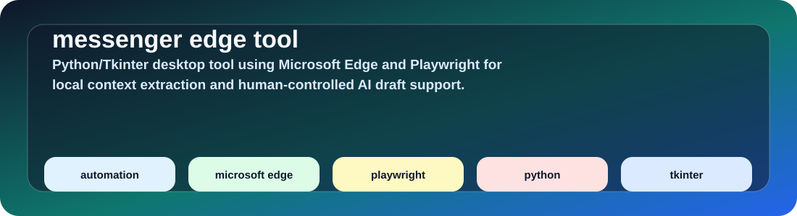

# Messenger Edge Tool

  

A Windows desktop utility for opening a selected Messenger conversation in Microsoft Edge, reviewing visible context, and preparing a reply draft. It uses Python, Tkinter, and Playwright with a local Edge profile.

## What the tool does

| Capability | Evidence |
|---|---|
| Local desktop interface | [`messenger_tool.py`](messenger_tool.py) provides the Tkinter workflow. |
| Persistent Edge session | The tool opens a local `edge_profile/`, which is excluded from Git. |
| Context review | It reads visible conversation text after the user opens the chosen conversation. |
| Draft assistance | It can insert a user-reviewed draft into the Messenger editor. |
| Explicit sending | The regular send action presents a confirmation dialog before pressing Enter. Automatic monitoring creates drafts only; it does not send messages. |

## Run locally

1. Install Python 3 and Microsoft Edge on Windows.
2. Run [`setup.ps1`](setup.ps1) to create `.venv` and install [`playwright==1.52.0`](requirements.txt).
3. Run [`run.bat`](run.bat), then sign in to Messenger in the Edge window if needed.
4. Choose a contact or target, review any extracted context, and inspect the draft before you use the confirmed send action.

The local profile, contact list, virtual environment, API-key environment files, and cache files are excluded by [`.gitignore`](.gitignore). Do not commit browser profiles, conversation content, API keys, or personal contact data.

## Review and safety notes

- This is a local, operator-driven tool. It is not a bulk sender, background messaging service, or unattended account automation system.
- Browser and platform terms, consent, and account access remain the operator's responsibility.
- The repository does not include credentials or a shared browser session.
- The visual asset is self-hosted and its SVG text is ASCII-safe for stable GitHub rendering.

## Release

The [2026 portfolio refresh](https://github.com/lhlizdabezt/messenger-edge-tool/releases/tag/portfolio-refresh-2026-08-29) contains the tagged source snapshot and the checked workflow visual. See [`RELEASE_NOTES.md`](RELEASE_NOTES.md) for the code and documentation changes.

## Profile and contact

[GitHub](https://github.com/lhlizdabezt) · [LinkedIn](https://www.linkedin.com/in/lhlizdabezt) · [Facebook](https://www.facebook.com/wageseadrake) · [Instagram](https://www.instagram.com/lhlizdabezt) · [YouTube](https://www.youtube.com/@lhlizdabezt) · [TikTok](https://www.tiktok.com/@wageseadrake) · [22207056@student.hcmus.edu.vn](mailto:22207056@student.hcmus.edu.vn) · [luonghailong.work@gmail.com](mailto:luonghailong.work@gmail.com) · [+84988114708](tel:+84988114708)
