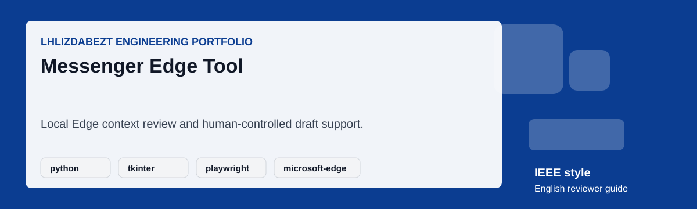

# Messenger Edge Tool

## Executive Summary

This repository presents a local desktop assistant for extracting visible Messenger context through Microsoft Edge and supporting human-controlled draft preparation. The portfolio framing emphasizes local tooling, UI discipline, browser automation boundaries, and responsible use rather than unattended messaging automation.

## Project Snapshot

| Field | Details |
|---|---|
| Repository | [lhlizdabezt/messenger-edge-tool](https://github.com/lhlizdabezt/messenger-edge-tool) |
| Portfolio Track | Python desktop tooling, Microsoft Edge automation, Playwright, and human-controlled AI drafting |
| Public Status | Reviewer-ready English guide with release-backed evidence |
| Latest Release | [Open stable release](https://github.com/lhlizdabezt/messenger-edge-tool/releases/latest) |
| Owner Profile | [lhlizdabezt](https://github.com/lhlizdabezt) |
| Contact | 22207056@student.hcmus.edu.vn; luonghailong.work@gmail.com; Tel: +84988114708 |

## Reviewer Evidence Map

- Python desktop source with a practical UI-oriented workflow.
- Browser automation logic constrained to user-controlled context review.
- Installation and run instructions suitable for a Windows portfolio environment.
- Clear public scope that avoids claims of unattended account automation.

## Implementation Review Notes

| Review Point | What To Check |
|---|---|
| Problem framing | Confirm that the README explains the engineering purpose without exaggerated claims. |
| Technical evidence | Inspect the source folders, reports, scripts, schematics, or visual assets listed below. |
| Reproducibility | Use the local instructions where tools are available, or rely on the release snapshot for portfolio review. |
| Communication quality | Check headings, captions, tables, and release notes for clear English technical writing. |
| Professional boundary | Treat the repository as educational or portfolio evidence unless the source explicitly proves production deployment. |

## Repository Structure

| Path | Reviewer Purpose |
|---|---|
| `*.py` | Python source files for desktop UI and automation support. |
| `requirements.txt` | Python dependency list when available. |
| `run.bat / setup.ps1` | Windows helper scripts when available. |
| `assets/` | Motion assets and reviewer card. |
| `RELEASE_NOTES.md` | Release changelog for the English reviewer guide. |

## How To Review

- Read the scope notes first to understand responsible automation boundaries.
- Inspect the Python UI and browser-control code paths.
- Check dependency files and Windows helper scripts for setup intent.
- Use the latest release as the stable public snapshot.

## How To Use Or Inspect Locally

- Create a Python virtual environment with `python -m venv .venv`.
- Install dependencies with `pip install -r requirements.txt` if that file is present.
- Install Playwright browser support if required by the local workflow.
- Run the main Python entry point and keep all final message decisions under human control.

## Visual Evidence

*Animated English reviewer card.*

## Release, Tags, And Topics

- Current release target: `reviewer-guide-2026-06-02`.
- Recommended topic set: `python, tkinter, playwright, microsoft-edge, desktop-app, automation, ai-tools, windows, human-in-the-loop, browser-automation`.
- Release notes are maintained in [`RELEASE_NOTES.md`](RELEASE_NOTES.md) for stable reviewer traceability.
- The release archive is intended for HR review, seminar evidence, and academic portfolio verification.

## Contact And Professional Links

| Channel | Link |
|---|---|
| GitHub | [https://github.com/lhlizdabezt](https://github.com/lhlizdabezt) |
| LinkedIn | [https://www.linkedin.com/in/lhlizdabezt](https://www.linkedin.com/in/lhlizdabezt) |
| Facebook | [https://www.facebook.com/wageseadrake](https://www.facebook.com/wageseadrake) |
| Instagram | [https://www.instagram.com/lhlizdabezt](https://www.instagram.com/lhlizdabezt) |
| YouTube | [https://www.youtube.com/@lhlizdabezt](https://www.youtube.com/@lhlizdabezt) |
| TikTok | [https://www.tiktok.com/@wageseadrake](https://www.tiktok.com/@wageseadrake) |
| Academic Email | [22207056@student.hcmus.edu.vn](mailto:22207056@student.hcmus.edu.vn) |
| Professional Email | [luonghailong.work@gmail.com](mailto:luonghailong.work@gmail.com) |
| Phone | [+84988114708](tel:+84988114708) |

## FAQ

| Question | Answer |
|---|---|
| Does this send messages automatically? | The public portfolio scope is human-controlled draft support, not unattended messaging automation. |
| Why use Microsoft Edge? | The project is designed around a local Windows browser workflow and Playwright integration. |
| What is the portfolio value? | It demonstrates practical Python UI work, browser automation, and responsible tool boundaries. |

## Scope And Boundaries

- This repository is presented as public engineering portfolio evidence.
- Claims are intentionally limited to what the repository, report, source files, simulations, or visual assets can support.
- Public text is written in English (United States) for HR, faculty, and engineering reviewers.
- SVG text is kept ASCII-safe to reduce rendering errors, mojibake, and missing-glyph blocks.
- Motion visuals avoid moving dotted paths, curved connector lines, and text-over-line compositions.

## Writing Standard

The public README, release notes, captions, and reviewer-facing metadata are written in a restrained IEEE and Harvard-inspired style: concise, evidence-first, technically accurate, and suitable for Electronics and Telecommunications portfolio review.
